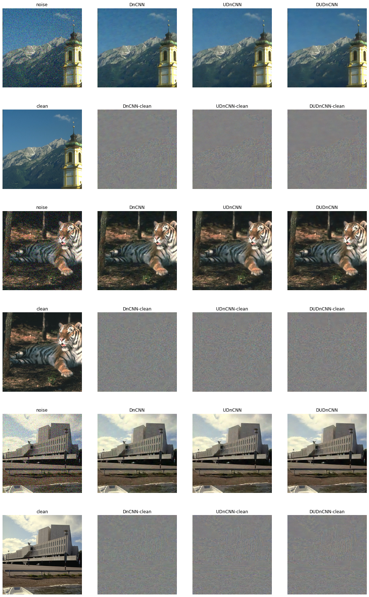
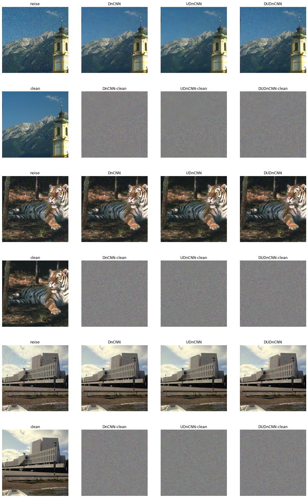

# From DnCNN to UDnCNN and DUDnCNN

ReLU

Leaky_ReLU

# DnCNNs with ReLU/Leaky_ReLU Activation

Models trained with CUDA, batch = 4, after 200 epochs each.  

No statistically significant [improvement](https://ieeexplore.ieee.org/document/9350117) with Leaky_ReLU in replace of ReLU, period.

### Raw DnCNNs with ReLU Activation

| Eval / CNNs | DnCNN       | UDnCNN      | DUDnCNN     |
| ----------- | ----------- | ----------- | ----------- |
| **PSNR**    | 29.0762     | 28.4196     | 29.3118     |
| **Loss**    | 0.005108381 | 0.005901728 | 0.004859959 |

### "Improved?" DnCNNs with Leaky_ReLU Activation

| Eval / CNNs | DnCNN             | UDnCNN            | DUDnCNN           |
| ----------- | ----------------- | ----------------- | ----------------- |
| **PSNR**    | 29.0926 **↑**     | 28.3110 **↓**     | 29.1659 **↓**     |
| **Loss**    | 0.005087597 **↓** | 0.006038793 **↑** | 0.005011519 **↑** |

###三种网络的比较
